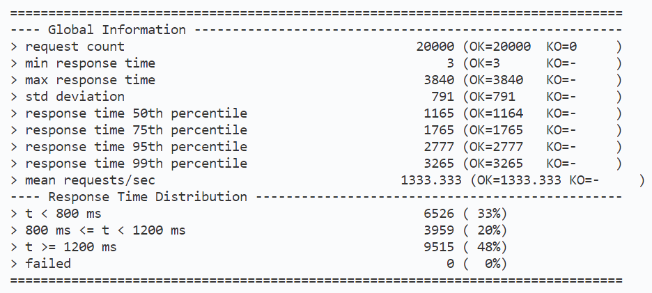

# aw09-final

## 功能简介

- 商品服务：
  - GET /products?page={page}&size={size}：分页浏览商品，page和size分别指定页号和每页的大小，默认值为0和64。数据库内共含82万条数据。
  - GET /products/{productId}：查询指定商品
- 购物车服务：
  - GET /cart：获取所有购物车项
  - GET /cart/{cartItemId}：获取某个购物车项
  - POST /cart：添加购物车项
  - PUT /cart/{cartItemId}：修改某个购物车项
  - DELETE /cart/{cartItemId}：删除某个购物车项
- 订单服务：
  - GET /orders：获取所有订单
  - GET /orders/{orderId}：获取某个订单
- 快递单服务：
  - GET /deliveries：获取所有快递单
  - GET /deliveries?orderId={orderId}：根据订单号查询快递单
  - GET /deliveries/{deliveryId}：获取某个快递单
- 购买：PUT /buy：会根据购物车项生成订单和快递单，然后清空购物车

## 设计思想

- 应对高并发访问：采用响应式架构，对于每个微服务都分离了“接收请求”和“处理请求”两部分，在“接收请求”的线程中只描述出“应该如何处理请求”，然后立即结束以接收其它请求，而将真正的处理过程（包括微服务间的网络IO、数据库IO、数据处理过程等）交给另一组“处理请求”的线程来实现。这样做控制了线程的总数量，可以用一组固定数量的接收线程和处理线程实现服务，而无需为每个请求都创建一个线程。

  通过spring-boot-starter-webflux实现，在Controller和Service层用Flux、Mono声明出数据处理的过程，为了配合其非阻塞的特性还使用了R2DBC。

- 健壮性：目的是不让服务内部的错误信息直接返回给前端，而是返回给前端合理的HTTP状态码和整洁的错误信息。 本次实验简单地将错误归结为HTTP 404（前端请求的资源不存在）和HTTP 500（服务器出错）两类。Gateway若从具体微服务处收到了4xx，则返回给前端404；若从具体微服务处收到5xx或具体微服务不可达，则返回给前端500。

  具体实现：Service层通过WebClient向具体微服务发出请求时通过onStatus方法识别出具体微服务返回的4xx和5xx，并构造出含有错误的Flux/Mono，其中包含检测到的错误信息（如果是具体微服务不可达，则无需手动检测并构造错误流），然后Controller层通过Flux/Mono的onErrorXXX系列方法检测到错误流并为前端构造相应错误的HTTP报文。

- 弹性：采用微服务架构，可以方便地进行水平向扩展。通过spring结合eureka实现。

- 松耦合：采用消息驱动的架构。微服务间需要相互调用，对于那种不需要被调用者立即返回数据的调用，可以采用消息驱动的方式以达到松耦合的特性——向被调用者发消息而不是直接的HTTP请求，等被调用者有空闲时再处理消息。通过spring结合rabbitmq实现。

- REST风格：

  - url代表资源：用url描述资源、HTTP方法描述对资源的操作类型、请求参数描述更具体的操作。比较特殊的是`PUT /buy`这一url，虽然gateway将“购买”这种服务单独设置为一个url，但其内部其实是分别调用了购物车服务的`DELETE /cart`和订单服务的`POST /orders`，即一系列对资源操作的组合，只是为前端提供了一个组合式的接口。此外之所以将方法设置为`PUT`是因为该服务是对资源的更改且具有幂等的特性。
  - 无状态：前后端交互时是无状态的，如在前端请求某页时，后端会连带返回该页前一页和后一页的链接，而不提供所谓“上一页”或“下一页”的服务。
  - 资源间的链接：在返回一个资源时，也返回了与其相关联的资源的链接。这样前端可以通过一个最基础的url接连不断地访问到系统内的全部资源，即使后端的url改变，前端也无需更改。

## 测试

### 可扩展性和应对高并发的性能

由于商品数据量大，“获取全部商品”是开销比较大的操作，因此针对`GET /products`做压力测试。

- 1个商品微服务，连续10次每次500个同时请求，每次请求64个商品：可以看到由于采用了响应式架构，平均响应时间仅有不到600ms，且没有失败的请求

  

- 1个商品微服务，连续10次每次2000个同时请求：即使采用了响应式架构，一个微服务还是应对不了如此高并发的请求

  

- 4个商品微服务，连续10次每次2000个同时请求：水平扩展，可以看到此时不会有请求失败出现，且平均响应时间仅有1200ms左右

	

### 健壮性

- 访问不存在的资源

  

- 断开商品微服务，请求商品

	
